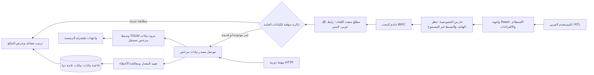

# معمارية منصة البحث العام في تيليجرام

## الهدف والنطاق

توفر المنصة بحثًا في **الكيانات العامة فقط**: القنوات والمجموعات العامة والحسابات ذات اسم مستخدم عام. لا تجمع المنصة جهات الاتصال، ولا تقبل أرقام الهاتف كمدخل بحث، ولا تحاول ربط اسم أو تهجئة بهوية شخص. لا تظهر إلا الحقول التي يرسلها المصدر المصرح به بوصفها عامة.

توضح وثائق TDLib أن `searchPublicChats` يبحث في العنوان والمعرّف العام، وأن `searchPublicChat` يحلّ اسم المستخدم العام مباشرةً؛ ولا يعد أي منهما فهرسًا مضمون الشمول لكل العالم أو بديلًا عن فهرس مرخّص. [1] [2]

## مخطط الطبقات

## مصدر البيانات الحقيقي

لا يقدم Bot API واجهة بحث عالمية عامة للقنوات والمجموعات والحسابات. لذلك لا ينفذ الموقع كشطًا لصفحات الويب ولا يختلق نتائج. يتصل الخادم فقط بوسيط بيانات مرخص عبر HTTPS، يملكه المشغّل أو يقدمه مزود مصرح به، ويستخدم TDLib أو واجهة Telegram ملائمة بتفويض صحيح.

يتطلب TDLib `api_id` و`api_hash` وتفويضًا لحساب العميل، ويحافظ على تخزين محلي وحالة تفويض؛ لذا ينبغي أن يبقى في خدمة وسيطة معزولة، لا في متصفح الزائر ولا في خادم الويب قصير العمر. [3] ويجب أن يحصل المشغّل على `api_id` خاص به وأن يمتثل لشروط Telegram API، ومنها حماية الخصوصية وعدم تنفيذ أفعال نيابة عن المستخدم بلا علمه أو موافقته. [4] [5]

| طبقة | المسؤولية | البيانات المسموح بها | ما لا تفعله |
|---|---|---|---|
| الواجهة | إدخال الاسم أو `@username` أو رابط `t.me`، وعرض النتائج | الاستعلام داخل الجلسة | لا تقرأ الهاتف أو دفتر العناوين |
| خادم التطبيق | التطبيع، حارس الخصوصية، الترتيب، التخزين المؤقت | استعلام قصير وبيانات عامة موحّدة | لا يسجل أرقامًا أو جلسات TDLib |
| موصل المصدر | يتصل بوسيط معتمد ويحترم حدّ الطلبات | نتائج عامة صادرة من المصدر | لا يستدعي مزودًا غير معدّ أو يكشط صفحات عامة |
| قاعدة البيانات | فهرس بيانات عامة دنيا ووقت التحديث | معرّف عام، الاسم، الوصف، النوع، إحصاءات عامة إن وجدت | لا تخزن الرسائل أو جهات الاتصال أو أرقام الهواتف |
| المهمة الدورية | تحديث كيانات مفهرسة سابقًا فقط | قائمة المعرفات العامة المعروفة | لا تكتشف مستخدمين أو تفهرس نطاقًا واسعًا |

## عقد موصل البحث

يقبل الخادم إعدادات الوسيط التالية فقط على الخادم: `TELEGRAM_PUBLIC_SEARCH_BASE_URL` و`TELEGRAM_PUBLIC_SEARCH_API_KEY`. لا تظهر هذه القيم للمتصفح. يعيد الوسيط كائنات موحّدة تحتوي على الاسم، والمعرّف العام، والنوع، والوصف والصورة إن كانت عامة، واللغة وطريقة المطابقة، وإحصاءات عامة اختيارية مع وقت مصدرها. إذا لم يكن الوسيط معدًا، تعرض المنصة حالة «المصدر غير معتمد بعد» بدل نتائج تجريبية.

## الترتيب واللغات

الترتيب يفسر للمستخدم: مطابقة المعرف الدقيق، ثم الرابط المحلول، ثم مطابقة بداية الاسم، ثم تطابق العنوان، ثم إشارات عامة اختيارية مثل عدد المشتركين ووقت التحديث. لا يدّعي ترتيب «النشاط» عندما لا يوفره المصدر. يطبع المحرك العلامات والاختلافات العربية الشائعة واللاتينية، ويقترح تهجئات أو نسخًا مترجمة للاستعلام؛ تستخدم الاقتراحات لتوسيع البحث في كيانات عامة فقط ولا تستنتج شخصًا أو رقمًا.

## التخزين المؤقت وحدود الطلبات

يطبّق الخادم حدًا لكل عميل وحدًا عامًا للمصدر، ويعيد استخدام نتيجة مخزنة لمدة قصيرة قابلة للضبط. لا يجلب التحديث الدوري سوى عدد محدود من السجلات المفهرسة سابقًا، ويعمل بطريقة idempotent؛ لا ينشأ الجدول الفعلي إلا بعد نشر الموقع واعتماد المصدر. تتطلب منصة الاستضافة أن يبدأ مسار المهمة الدورية بـ`/api/scheduled/` وأن يكون المعالج موثقًا ومحصنًا ضد إعادة المحاولة.

## الخصوصية والامتثال

> الحسابات ذات المعرف العام يمكن العثور عليها في البحث العام ومراسلتها عبر هذا المعرف، فيما يظل رقم الهاتف غير مطلوب لهذا المسار. [6]

تحتفظ المنصة بأقل قدر من البيانات العامة اللازمة للتشغيل، وتعرض رابط المصدر ووقت آخر تحديث، وتتيح الإبلاغ عن نتيجة، ولا تنشئ ملف تعريف للأفراد. تحظر شروط Telegram API تجميع البيانات لاستخدامها في تدريب نماذج الذكاء الاصطناعي أو تطويرها. [4]

## المراجع

[1]: https://core.telegram.org/tdlib/docs/classtd_1_1td__api_1_1search_public_chats.html "TDLib: searchPublicChats"
[2]: https://core.telegram.org/tdlib/docs/classtd_1_1td__api_1_1search_public_chat.html "TDLib: searchPublicChat"
[3]: https://core.telegram.org/tdlib/getting-started "Getting started with TDLib"
[4]: https://core.telegram.org/api/terms "Telegram API Terms of Service"
[5]: https://core.telegram.org/api/obtaining_api_id "Creating your Telegram Application"
[6]: https://telegram.org/faq "Telegram FAQ"
